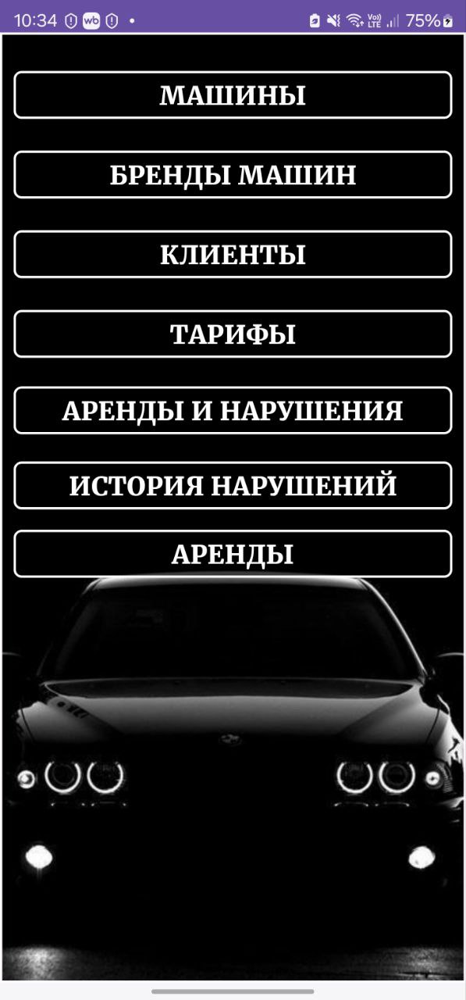
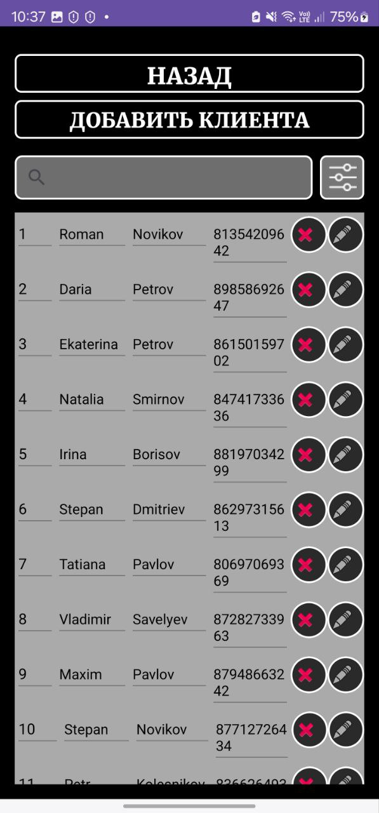
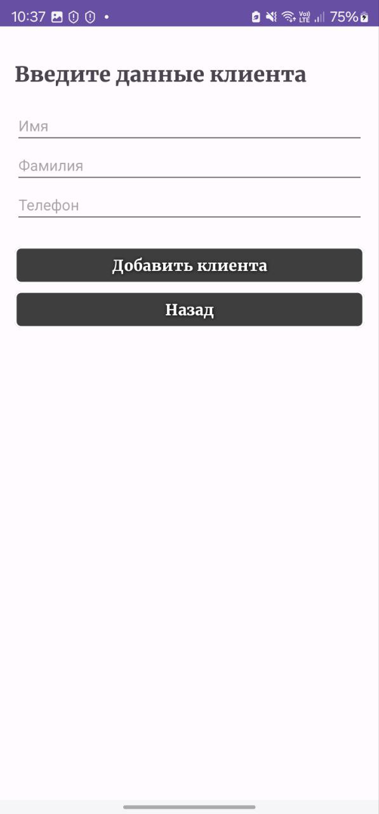
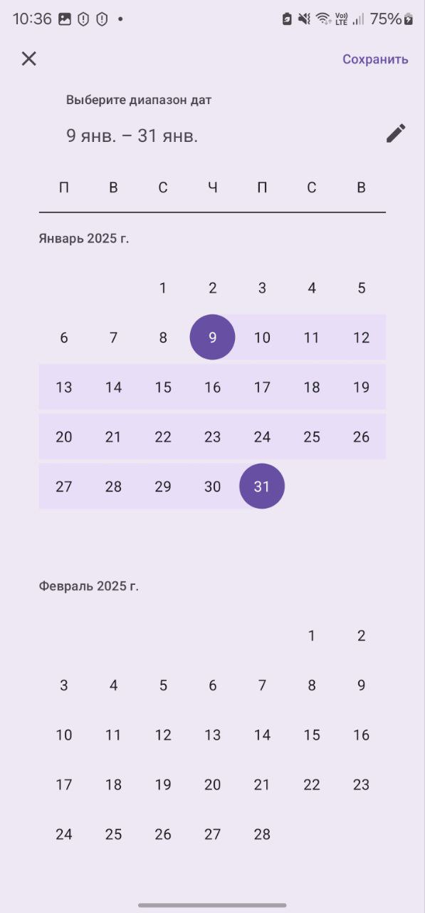
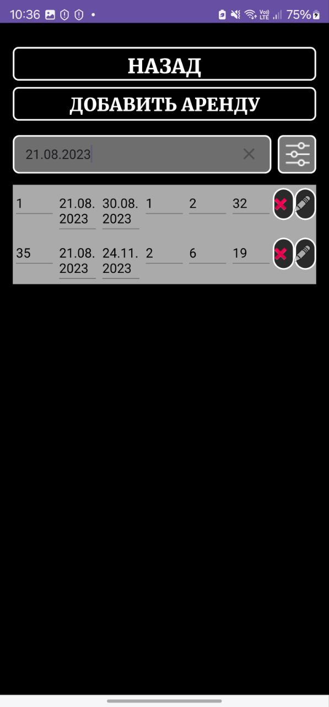

# Car Sharing App

Car Sharing App – эффективный инструмент для управления каршеринговым бизнесом.  Ваш главный помощник в оптимизации процесса аренды, управления автопарком и аналитики.
## Содержание
-   [Функциональность](#функциональность)
-   [Экраны](#Экраны)
-   [Стек технологий](#стек)

## Функциональность

1.  Храните личные данные клиентов, историю аренд, статусы платежей. 
2. Быстро и просто редактируйте данные в таблицах.
3. Отслеживайте статусы оплаты аренд и фильтруйте их по дате для анализа.
4. Фиксируйте нарушения с указанием даты, клиента, автомобиля, добавляйте комментарии и штрафы.
5. Система аналитики позволяет получать ценные данные о клиентах, арендах и нарушениях, помогая принимать обоснованные решения.

## Экраны

### Главный экран

### Меню выбора

### Внешний вид таблиц

### Форма добавления клиента

### Фильтрация по дате

### Демонстрация работы поиска

## Стек
-   **Frontend:** [Kotlin](https://kotlinlang.org/), [XML](https://www.w3.org/XML/), [Retrofit](https://square.github.io/retrofit/) 
-   **Backend:** [Python](https://www.python.org/), [Flask](https://flask.palletsprojects.com/en/stable/), [SQLAlchemy](https://www.sqlalchemy.org/)
-   **Database:** [SQLite](https://www.sqlite.org/)
